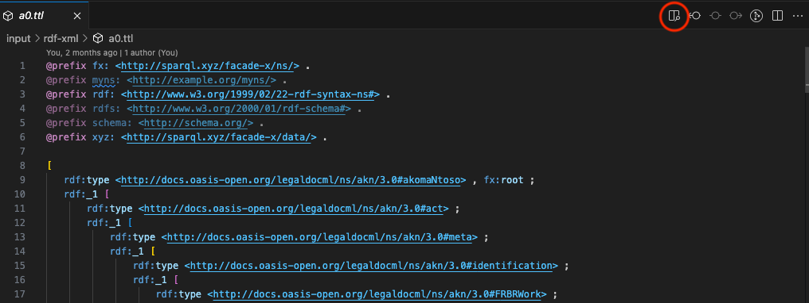

# VSCode RDF Sketch

This extension provides a way to visualize RDF data in [Visual Studio Code](https://code.visualstudio.com).

This extension is based on our [Zazuko Sketch](https://sketch.zazuko.com/) web app. Code is available [here](https://github.com/zazuko/rdf-sketch).

## Features

* Visualize RDF data in a separate Visual Studio Code tab
* Auto-layout & zoom
* Search for nodes
* Move nodes around
* Navigate to the source node by clicking on the edge
* Navigate to the destination node by clicking Object in the triple

## Installation

You can install it directly from the Visual Studio Code Extension tab. It is available on the [Marketplace](https://marketplace.visualstudio.com/items?itemName=Zazuko.vscode-rdf-sketch)

## Usage

1. Open an RDF file in Visual Studio Code
2. Then click the preview icon on the top right corner of the editor 
3. A new tab will open with the visualization 

# Demo

### Limitations

* Currently, it only supports N3/Turtle RDF serializations.
* While you can move around boxes, the layout will not persist. Every time something in the data changes, it will auto-layout again and discard what you did before.
* [YMMV](https://www.urbandictionary.com/define.php?term=ymmv) regarding how much data and what kind of graph you can visualize in a useful way.

## Development

To start the extension from this repository:

- Open Visual Studio Code for this repository
- Open debug panel
- Hit *Run extension* on the upper right corner
- To open dev tools: `Ctrl+P` and toggle developer tools